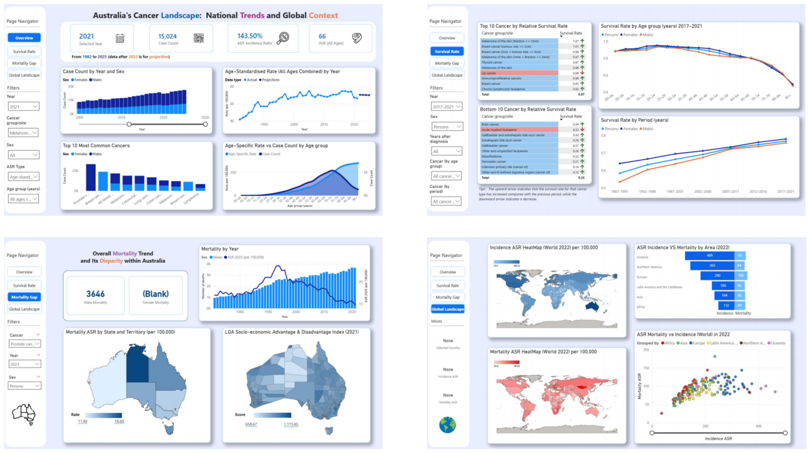

# Australia’s Cancer Landscape
Awarded **Second Prize** 🏆 at the **2025 University of Adelaide Data Visualization Competition**.

Through a series of visualizations, we tell the story of how the cancer landscape has evolved over time, how improvements in the healthcare system have reduced mortality rates, and how outcomes differ across regions.

## 1. Dataset 🗂️
- [**The Australian Institute of Health and Welfare (AIHW)**](https://www.aihw.gov.au/reports/australias-health/cancer) provides the majority of the national statistics regarding to cancer including incidence, mortality and survival rates.
- We linked cancer outcomes to geographic advantages through the Socio-Economic Indexes for Areas (SEIFA) by [**Australian Bureau of Statistics (ABS)**](https://www.abs.gov.au/statistics/people/people-and-communities/socio-economic-indexes-areas-seifa-australia/latest-release)
- We also collected international data from the [**International Agency for Research on Cancer (IARC)**](https://gco.iarc.fr/today/) to compare Australia's cancer trends against other nations.

## 2. Methodology ⚙️
Cancer risk is highly correlated with age, the older population appears to have a higher cancer burden even if the underlying risk is similar.

To account for this, all incidence and mortality measures in this project are compared in the **age-standardised rate (ASR)**, which removes the effect of age from a population.

## 3. Key Insights :eyes:
### Incidence 📈
- **Total cancer case counts** have increased over time, driven mainly by population growth and ageing, while age-standardised incidence rates have remained relatively stable, fluctuating around 65-75 cases per 100,000 since 2000.

### Survival Rate ❤️ (5-year relative survival)
- **Overall cancer survival** has improved steadily since the late 1980s, with 77% of people surviving at least five years after diagnosis, representing an increase of about 20% compared with the 1980s.
- The **gender gap in survival** has narrowed substantially: from an 11% difference in 1987, male survival now lags behind that of female by only around 2%.

### Mortality ⚠️
- **Males consistently experience higher cancer mortality than females**, largely linked to lifestyle factors and lower engagement in preventive healthcare.
- **Prostate cancer** is the most commonly diagnosed cancer in Australia. However, the introduction of a new antigen testing in the mid-1990s led to a sustained decline in mortality. After peaking at 24 deaths per 100,000 in 1994, the **mortality rate fell to 15 by 2021**.
- **Queensland records the highest melanoma mortality rate** in Australia **(7.5 deaths per 100,000)**, strongly linked to prolonged ☀️ sun exposure among its population.
- **The Northern Territory’s low socioeconomic score is associated with the highest cancer mortality rate (255 per 100,000)**, driven by lower income and education levels, as well as limited access to screening and specialist care across vast geographic areas.
  
### Global Landscape :earth_asia:
- **High cancer incidence does not translate into high mortality**: regions such as Oceania and North America exhibit the highest incidence rates globally but relatively low mortality, reflecting strong early detection and treatment capacity.
- **Australia stands out globally**, occupying the high-incidence, low-mortality quadrant, which underscores how a well-resourced healthcare system can translate early detection into improved survival outcomes.
